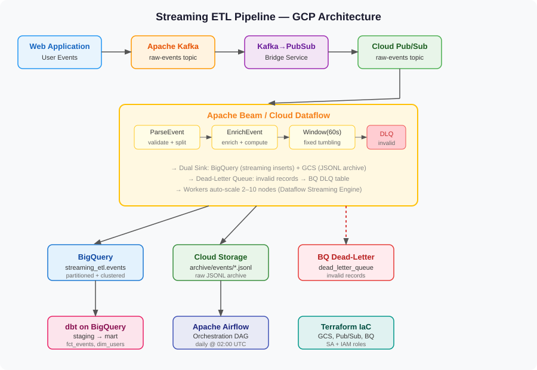

# Streaming ETL Pipeline — GCP


> Production-grade streaming ETL pipeline on GCP. User-activity events flow from a Kafka topic through a Kafka→Pub/Sub bridge into an Apache Beam / Cloud Dataflow pipeline that validates, enriches, windows, and dual-sinks to BigQuery (streaming inserts) and GCS (JSONL archive). Invalid records route to a Dead-Letter Queue. dbt transforms raw events into analytical mart tables. Airflow orchestrates the daily batch layer. Terraform provisions all GCP infrastructure.

---

## Table of Contents
- [Architecture](#architecture)
- [Pipeline Flow](#pipeline-flow)
- [Project Structure](#project-structure)
- [Components](#components)
- [BigQuery Schema](#bigquery-schema)
- [dbt Models](#dbt-models)
- [Setup](#setup)
- [Running Locally](#running-locally)
- [Deploying to GCP](#deploying-to-gcp)
- [Testing](#testing)
- [Skills Demonstrated](#skills-demonstrated)

---

## Architecture



---

## Pipeline Flow

```
Web Application (user events: page_view, add_to_cart, purchase, search, login, logout)
        |
        v
Apache Kafka  [kafka/producer.py]
  Topic: streaming-etl.raw-events  (6 partitions, lz4 compression)
        |
        v
Kafka → Pub/Sub Bridge  [kafka/kafka_to_pubsub.py]
  Consumer group: kafka-pubsub-bridge
  Exactly-once: commit Kafka offsets only after Pub/Sub ACK
        |
        v
Google Cloud Pub/Sub
  Topic: raw-events
  Subscription: dataflow-events-sub  (DLQ after 5 retries)
        |
        v
Apache Beam / Cloud Dataflow  [dataflow/pipeline.py + transforms.py]
  |-- ParseEvent      → validate schema, split valid/invalid (tagged outputs)
  |-- EnrichEvent     → compute purchase_tier, session_start flag
  |-- FixedWindows(60s) → 60-second tumbling windows
  |-- AddWindowTimestamps → stamp window_start / window_end
  |
  +-- [valid]   → BigQuery (streaming inserts)  streaming_etl.events
  +-- [valid]   → GCS archive (JSONL)           gs://bucket/archive/events/
  +-- [invalid] → BigQuery DLQ                  streaming_etl.dead_letter_queue
        |
        v
dbt on BigQuery  [dbt/models/]
  staging/    stg_events.sql      — deduplicate, type-cast, normalise
              stg_users.sql       — user spine from event stream
  intermediate/ int_session_events.sql — session-level aggregates
  mart/       fct_events.sql      — incremental event fact table (partitioned)
              dim_users.sql       — user dimension with LTV segments
        |
        v
Airflow DAG  [airflow/dags/streaming_pipeline_dag.py]
  Daily @ 02:00 UTC:
  check_dataflow_health → (restart if needed) → dbt_run → dbt_test → audit_log
```

---

## Project Structure

```
streaming-etl-pipeline-gcp/
|
|-- kafka/
|   |-- schemas.py           # UserEvent dataclass, EventType enum, BQ schemas
|   |-- producer.py          # Synthetic event producer (50–200 events/sec)
|   |-- kafka_to_pubsub.py   # Kafka consumer → Pub/Sub bridge (exactly-once)
|
|-- dataflow/
|   |-- pipeline.py          # Main Beam pipeline: ingest → enrich → dual sink
|   |-- transforms.py        # ParseEvent, EnrichEvent, AddWindowTimestamps DoFns
|
|-- dbt/
|   |-- dbt_project.yml
|   |-- models/
|   |   |-- staging/         stg_events.sql, stg_users.sql
|   |   |-- intermediate/    int_session_events.sql
|   |   |-- mart/            fct_events.sql (incremental), dim_users.sql
|   |-- tests/               custom dbt data-quality tests
|
|-- airflow/
|   |-- dags/
|       |-- streaming_pipeline_dag.py  # Dataflow health + dbt + audit
|
|-- terraform/
|   |-- main.tf              # GCS, Pub/Sub, BigQuery, SA, IAM
|   |-- variables.tf
|   |-- outputs.tf
|
|-- tests/
|   |-- test_transforms.py   # 10 unit tests for Beam DoFns
|   |-- test_pipeline.py     # Schema + config validation tests
|
|-- snapshots/
|   |-- architecture.svg     # Full pipeline architecture diagram
|
|-- docker/
|   |-- Dockerfile
|   |-- docker-compose.yml   # Kafka + ZooKeeper + bridge + producer
|
|-- .env.example
|-- requirements.txt
|-- pyproject.toml
|-- Makefile
```

---

## Components

### Kafka Producer — `kafka/producer.py`
Simulates a web application producing 6 event types with realistic properties:

| Event Type | Properties |
|---|---|
| `page_view` | page, referrer, load_time_ms |
| `add_to_cart` | product_id, quantity, price_usd |
| `purchase` | order_id, items, total_usd, payment_method |
| `search` | query, results_count |
| `login` / `logout` | method |

Event distribution mirrors real e-commerce traffic (45% page views, 20% cart adds, 8% purchases).

### Kafka → Pub/Sub Bridge — `kafka/kafka_to_pubsub.py`
- Consumes from Kafka in batches of 100 messages
- Publishes to Pub/Sub with Kafka offset metadata
- **Exactly-once**: commits Kafka offsets only after all Pub/Sub futures succeed
- Handles SIGTERM for zero-message-loss shutdown

### Beam Pipeline — `dataflow/pipeline.py` + `transforms.py`

| Transform | Input | Output |
|---|---|---|
| `ParseEvent` | Raw bytes | Tagged: valid dict / DLQ dict |
| `EnrichEvent` | Valid dict | Enriched with purchase_tier, session_start |
| `FixedWindows(60s)` | Stream | 60-second tumbling windows |
| `AddWindowTimestamps` | Windowed | + window_start, window_end |

**Sinks:**
- BigQuery — streaming inserts (low-latency, queryable seconds after ingestion)
- GCS — JSONL archive (cost-efficient long-term storage)
- BigQuery DLQ — all invalid records with error reason

### dbt Models — `dbt/models/`
Full layered transformation:
1. **`stg_events`** — deduplicates on event_id, casts types, normalises nulls
2. **`stg_users`** — user spine with first/last seen and activity counts
3. **`int_session_events`** — session-level aggregations (duration, event counts, revenue)
4. **`fct_events`** — incremental fact table, partitioned by event_date, clustered by event_type + country
5. **`dim_users`** — user dimension with LTV and engagement tiers (platinum/gold/silver/bronze/prospect)

### Airflow DAG — `airflow/dags/streaming_pipeline_dag.py`
Daily orchestration at 02:00 UTC:
1. Check if Dataflow streaming job is active (branch on result)
2. Restart Dataflow using Flex Template if needed
3. Run dbt staging models + tests
4. Run dbt intermediate models
5. Run dbt mart models + tests
6. Write audit record to BigQuery `pipeline_audit_log`

### Terraform — `terraform/`
Provisions all GCP resources:
- GCS bucket with lifecycle rules (90d → Nearline, 365d → Delete)
- Pub/Sub topic + subscription with DLQ policy (max 5 retries)
- BigQuery dataset + tables with partitioning and clustering
- Dedicated Dataflow service account with least-privilege IAM roles

---

## BigQuery Schema

```sql
-- streaming_etl.events  (Dataflow writes via streaming inserts)
-- PARTITION BY DATE(event_ts)  CLUSTER BY event_type, country
event_id      STRING    REQUIRED
event_type    STRING    REQUIRED   -- page_view | add_to_cart | purchase | search | login | logout
user_id       STRING    REQUIRED
session_id    STRING    REQUIRED
event_ts      TIMESTAMP REQUIRED
properties    STRING    NULLABLE   -- JSON blob with event-specific fields
country       STRING    NULLABLE
platform      STRING    NULLABLE   -- web | ios | android
is_valid      BOOLEAN   REQUIRED
processed_at  TIMESTAMP REQUIRED
window_start  TIMESTAMP NULLABLE
window_end    TIMESTAMP NULLABLE

-- streaming_etl.dead_letter_queue
raw_message   STRING    REQUIRED   -- original bytes (truncated to 4096 chars)
error_reason  STRING    REQUIRED
topic         STRING    NULLABLE
failed_at     TIMESTAMP REQUIRED
```

---

## dbt Models

```
Sources         staging          intermediate        mart
──────────      ──────────       ──────────────      ──────────────────────
events     ──>  stg_events  ──>  int_session    ──>  fct_events  (incremental)
               stg_users   ─────────────────────>    dim_users
```

| Model | Materialisation | Key Features |
|---|---|---|
| `stg_events` | view | dedup on event_id, type casting, null handling |
| `stg_users` | view | user spine, activity aggregates |
| `int_session_events` | ephemeral | session duration, engagement counts |
| `fct_events` | incremental table | partitioned by date, clustered, purchase enrichment |
| `dim_users` | table | LTV tiers, engagement segments |

---

## Setup

### Prerequisites
- GCP project with Dataflow, Pub/Sub, BigQuery, GCS APIs enabled
- Terraform >= 1.5, Docker, Python 3.11+

```bash
git clone https://github.com/jaiminbabariya7/streaming-etl-pipeline-gcp
cd streaming-etl-pipeline-gcp
cp .env.example .env
# Fill in GCP_PROJECT_ID and credentials path

make install
```

### Provision GCP infrastructure
```bash
make terraform-init
make terraform-apply  # creates GCS, Pub/Sub, BigQuery, SA
```

---

## Running Locally

```bash
# 1. Start Kafka + ZooKeeper via Docker
make docker-up

# 2. Start event producer (50 events/sec)
make run-producer

# 3. Start Kafka → Pub/Sub bridge
make run-bridge

# 4. Run Beam pipeline locally (DirectRunner)
make run-pipeline-local

# 5. Run dbt models
make dbt-run && make dbt-test
```

---

## Deploying to GCP

```bash
# Deploy Dataflow streaming pipeline
make run-pipeline-gcp

# Deploy Airflow DAG (Cloud Composer)
gcloud composer environments storage dags import \
  --environment streaming-etl-composer \
  --location us-central1 \
  --source airflow/dags/streaming_pipeline_dag.py
```

---

## Testing

```bash
make test
# pytest tests/ -v --cov=kafka --cov=dataflow
#
# tests/test_transforms.py::TestParseEvent::test_valid_event_parsed       PASSED
# tests/test_transforms.py::TestParseEvent::test_invalid_json_goes_to_dlq PASSED
# tests/test_transforms.py::TestEnrichEvent::test_purchase_tier_added     PASSED
# tests/test_transforms.py::TestSchemas::test_purchase_tier_boundaries    PASSED
# tests/test_pipeline.py::TestSchemaDefinitions::test_bq_events_schema    PASSED
# ... 14 tests total
```

---

## Skills Demonstrated
`Apache Kafka` · `Google Cloud Pub/Sub` · `Apache Beam` · `Cloud Dataflow` · `BigQuery` · `Cloud Storage` · `dbt Core` · `Apache Airflow` · `Terraform` · `Docker` · `Python` · `Streaming ETL` · `Dead-Letter Queue` · `Data Modeling` · `IaC`
